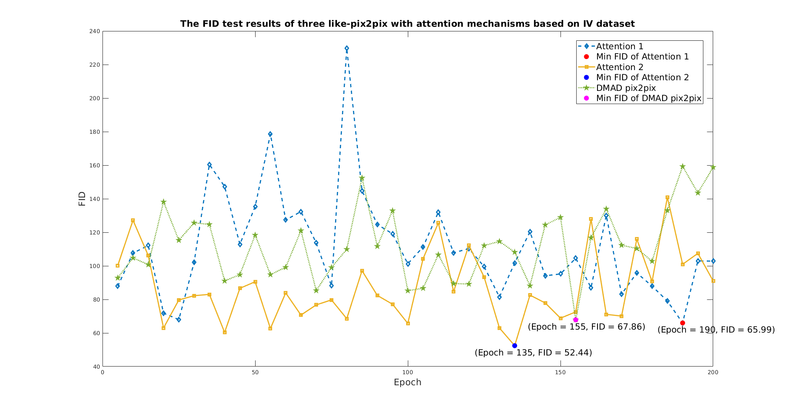

<font size =4 face=宋体>&emsp;&emsp;**[原始<font size =4 face=Times New Roman>README</font>](README_original.md)**
</font>
<br>


<font size =4 face=宋体>&emsp;&emsp;最近在做毕设，翻GitHub时看到原作者的repo，就尝试拿来跑一下自己的数据。结果一上来就报错（除了一些通用性比较高的repo外，很多都会遇到这种问题），解决了半天的环境问题，遇到下面的这个错误：
</font>
<br>

```
/home/wlw19/miniconda3/lib/python3.8/site-packages/torchvision/transforms/transforms.py:257: UserWarning: Argument interpolation should be of type InterpolationMode instead of int. Please, use InterpolationMode enum.
  warnings.warn(
/home/wlw19/miniconda3/lib/python3.8/site-packages/torchvision/models/inception.py:80: FutureWarning: The default weight initialization of inception_v3 will be changed in future releases of torchvision. If you wish to keep the old behavior (which leads to long initialization times due to scipy/scipy#11299), please set init_weights=True.
  warnings.warn('The default weight initialization of inception_v3 will be changed in future releases of '
Traceback (most recent call last):
  File "train.py", line 278, in <module>
    test(model, opt, logger, total_iters, best_AtoB_fid, best_BtoA_fid, best_AtoB_epoch,
  File "train.py", line 173, in test
    fid = test_pix2pix_fid(model, copy.copy(opt))
  File "train.py", line 92, in test_pix2pix_fid
    fid = get_fid(list(fake_B.values()), inception_model, npz, model.device, opt.batch_size)
  File "/media/wlw19/Elements/415_experiments/WH/code/DMAD-master/metric/__init__.py", line 9, in get_fid
    m1, s1 = npz['mu'], npz['sigma']
  File "/home/wlw19/.local/lib/python3.8/site-packages/numpy/lib/npyio.py", line 259, in __getitem__
    raise KeyError("%s is not a file in the archive" % key)
KeyError: 'mu is not a file in the archive'
```

<font size =4 face=宋体>&emsp;&emsp;刚开始我没有看源码，对这个错误不明所以，看了后才知道：原作者是一边训练数据、训练一次后就测试FID，并把FID值最低的模型权重的epoch数、FID值都保存下来，报错代码的**m2, s1**就是用来测试FID的。但我用自己的数据所生成的**npz**文件没有这两个标签，所以报错。（我写了个脚本，测了一下自己数据生成的 **npz** ，只有一个vol标签）
</font>
<br>

<font size =4 face=宋体>&emsp;&emsp;反正，报错信息是与计算FID有关的，那我换种方式计算FID就行了。正好源码的 **metric** 文件夹下 **fid_score.py**就是用来计算FID的，而且提供了图片路径作为参数计算FID的函数 **calculate_fid_given_paths**。那么，直接把**train.py**相应的代码注释掉，换成**calculate_fid_given_paths**来计算FID就可以了。
</font>
<br>

<font size =4 face=宋体>&emsp;&emsp;训练、测试跑完后，发现这个repo的pix2pix并不适合我的数据，弃用。如图1所示，Attention 1和 Attention 2是我自己的方法。
</font>
<br>

<center>
    
    <br>
    <div style="color:orange; border-bottom: 1px solid #d9d9d9;
    display: inline-block;
    color: #999;
    padding: 2px;">图 1 Epoch对比</div>
</center>
<br>